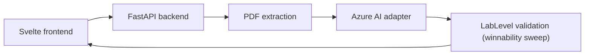

# Hyperplay

HyperPlay turns educational material into interactive experiences students can manipulate. A student picks a subject and level, uploads a chapter, and the backend asks Azure OpenAI for a **Relationship Lab** level: two sliders, the chapter's formula, and an ordered ladder of challenges (lock one control, lock the other, then both). The model returns data, never code. The backend proves every challenge is winnable before the front end renders it with one of four visual modes (`trajectory`, `curve`, `fill`, `meter`). The learning experience centers on experimentation rather than a chat window.

## Architecture



## Team boundaries

- **Frontend:** Svelte UI, safe expression evaluation, visualization, controls, and challenge UX.
- **Azure AI:** resource provisioning, deployment selection, and prompt experiments.
- **Backend/integration:** repository contract, PDF extraction, Azure adapter, validation, errors,
  fallback demo, and integration testing.

## Repository

```text
frontend/   Frontend teammate workspace
backend/    FastAPI API, tests, and Azure adapter
contracts/  Shared JSON Schemas and verified example levels
```

`contracts/lab-level.schema.json` is the current contract (v2), mirrored by
`frontend/src/lib/games/lab/types.ts` and `backend/app/models/lab.py`. The four verified levels in
`contracts/examples/labs/` and the backend prompt in `backend/app/prompts/lab_system_prompt.txt`
are generated from the front end with `cd frontend && npm run export:contracts`. Re-run it after
editing `levels.ts`, `routing.ts`, or `fewshot.ts`, then run the backend tests.

The frontend can begin immediately with
[`contracts/examples/projectile-motion.json`](contracts/examples/projectile-motion.json) or the
demo endpoint. The example is the API agreement between the three workstreams.

## Run the backend

### Bash or WSL

```bash
cd backend
python3 -m venv .venv
source .venv/bin/activate
pip install -r requirements-dev.txt
cp ../.env.example .env
uvicorn app.main:app --reload
```

### Windows PowerShell

```powershell
cd backend
py -m venv .venv
.\.venv\Scripts\Activate.ps1
pip install -r requirements-dev.txt
Copy-Item ..\.env.example .env
uvicorn app.main:app --reload
```

Open `http://127.0.0.1:8000/docs` for interactive API documentation.

## Run the frontend

```bash
cd frontend
npm install
npm run dev
```

Vite proxies `/api` to `http://127.0.0.1:8000`, so run the backend alongside it. Set
`VITE_API_PROXY` if the backend runs elsewhere.

## API

| Method | Route | Purpose |
| --- | --- | --- |
| GET | `/api/v1/health` | Service health and Azure configuration status |
| GET | `/api/v1/simulations/demo` | Always-available projectile-motion fixture |
| POST | `/api/v1/simulations/generate` | Generate a v1 `SimulationSpec` from a `text` field or PDF `file` |
| POST | `/api/v1/labs/generate` | Generate a Relationship Lab level (`subject`, `gradeLevel` = `middle`/`high`/`college`, optional `course`, plus `text` or PDF `file`) |

Both generation endpoints accept `multipart/form-data`. PDF uploads are processed in memory and
are not persisted.

`/labs/generate` returns `200` with either a `LabLevel` or `{"gameType": "unfittable", "reason", "suggestion"}`
when the chapter has no two-variable relationship. The `X-HyperPlay-Source` header is `generated`,
or `cache` when Azure failed and the backend replayed the level it generated earlier from the same
file (kept in memory only). File problems return `4xx` with an error code, and AI problems return
`502`/`503`. The front end shows file errors on the upload screen and otherwise falls back to a
built-in level that is always labelled **Sample level**. It is never presented as generated from
the upload.

## Configuration

Copy `.env.example` to `backend/.env`. The Azure teammate must supply the endpoint, API key,
deployment name, and API version. The endpoint is the resource URL
(`https://<resource>.openai.azure.com`), not the Foundry project endpoint, and the deployment is
the name from the Deployments list, not the model name. `AZURE_OPENAI_KEY` is accepted as an
alias for `AZURE_OPENAI_API_KEY`. Never put these values in the frontend or commit `.env`.

Without Azure credentials, health and demo continue to work. Live generation returns a clear
`AI_NOT_CONFIGURED` error. Set `ENABLE_DEVELOPMENT_FALLBACK=true` only for local integration; the
fallback is a static demo and must not be represented as analysis of an uploaded document.

## Hosting

Live at **https://hyperplay.azurewebsites.net**, on one Azure App Service (Linux, Python 3.11,
West US, resource group `hyperplay-rg`). The backend serves the built front end from `static/`,
so the page and the API share one origin and need no CORS or API URL configuration.

Every push to `main` runs `.github/workflows/deploy.yml`. It checks and builds the front end,
runs ruff and pytest, packages `backend/app`, `contracts/` and `frontend/dist`, and deploys.
Nothing deploys if a check fails. GitHub signs in to Azure with OpenID Connect through the
managed identity `hyperplay-deploy`, which only trusts `main` of this repository and may only
deploy to this web app. No deploy password is stored anywhere.

The Azure OpenAI settings are App Service application settings, not files in the repo. To
change them:

```bash
az webapp config appsettings set -g hyperplay-rg -n hyperplay --settings AZURE_OPENAI_DEPLOYMENT=<name>
```

Useful commands: `az webapp log tail -g hyperplay-rg -n hyperplay` streams live logs, and
`az group delete -n hyperplay-rg` removes everything after the hackathon.

## Quality checks

```bash
cd backend
ruff check .
pytest -q
python scripts/export_schema.py
```

## Collaboration

Suggested short-lived branches:

- `feat/frontend`
- `feat/backend`
- `feat/azure-ai`

Keep `main` demoable. Coordinate any changes to `contracts/` because they affect every workstream.

## MVP limitations

- Supports only the Relationship Lab engine. Chapters without a two-variable relationship get an
  honest "doesn't fit" screen. `frontend/src/lib/games/debug/` holds types for a future
  Computer Science engine.
- Accepts text-based PDFs; scanned-image OCR is not included.
- Does not store documents or simulations.
- Does not verify that an AI-generated scientific formula is factually correct; it validates the
  structure and safety of the expression. The interface should expose formulas and source evidence
  for human review.

