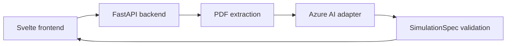

# Hyperplay

HyperPlay turns educational material into interactive experiences students can manipulate. The Svelte frontend currently includes a playable projectile simulation and a file-selection flow. The backend accepts PDF or text input, extracts the material, and validates a constrained `SimulationSpec` generated through Azure AI. Connecting generated specs and uploads to the frontend is still in progress. The learning experience centers on experimentation rather than a chat window.

## Architecture



## Team boundaries

- **Frontend:** Svelte UI, safe expression evaluation, visualization, controls, and challenge UX.
- **Azure AI:** resource provisioning, deployment selection, and prompt experiments.
- **Backend/integration:** repository contract, PDF extraction, Azure adapter, validation, errors,
  fallback demo, and integration testing.

## Repository

```text
frontend/   Frontend teammate workspace
backend/    FastAPI API, tests, and Azure adapter
contracts/  Shared JSON Schema and example payload
```

The frontend can begin immediately with
[`contracts/examples/projectile-motion.json`](contracts/examples/projectile-motion.json) or the
demo endpoint. The example is the API agreement between the three workstreams.

## Run the backend

### Bash or WSL

```bash
cd backend
python3 -m venv .venv
source .venv/bin/activate
pip install -r requirements-dev.txt
cp ../.env.example .env
uvicorn app.main:app --reload
```

### Windows PowerShell

```powershell
cd backend
py -m venv .venv
.\.venv\Scripts\Activate.ps1
pip install -r requirements-dev.txt
Copy-Item ..\.env.example .env
uvicorn app.main:app --reload
```

Open `http://127.0.0.1:8000/docs` for interactive API documentation.

## API

| Method | Route | Purpose |
| --- | --- | --- |
| GET | `/api/v1/health` | Service health and Azure configuration status |
| GET | `/api/v1/simulations/demo` | Always-available projectile-motion fixture |
| POST | `/api/v1/simulations/generate` | Generate from a `text` field or PDF `file` |

The generation endpoint accepts `multipart/form-data`. PDF uploads are processed in memory and
are not persisted.

## Configuration

Copy `.env.example` to `backend/.env`. The Azure teammate must supply the endpoint, API key,
deployment name, and API version. Never put these values in the frontend or commit `.env`.

Without Azure credentials, health and demo continue to work. Live generation returns a clear
`AI_NOT_CONFIGURED` error. Set `ENABLE_DEVELOPMENT_FALLBACK=true` only for local integration; the
fallback is a static demo and must not be represented as analysis of an uploaded document.

## Quality checks

```bash
cd backend
ruff check .
pytest -q
python scripts/export_schema.py
```

## Collaboration

Suggested short-lived branches:

- `feat/frontend`
- `feat/backend`
- `feat/azure-ai`

Keep `main` demoable. Coordinate any changes to `contracts/` because they affect every workstream.

## MVP limitations

- Supports only the `relationship_lab` template.
- Accepts text-based PDFs; scanned-image OCR is not included.
- Does not store documents or simulations.
- Does not verify that an AI-generated scientific formula is factually correct; it validates the
  structure and safety of the expression. The interface should expose formulas and source evidence
  for human review.

